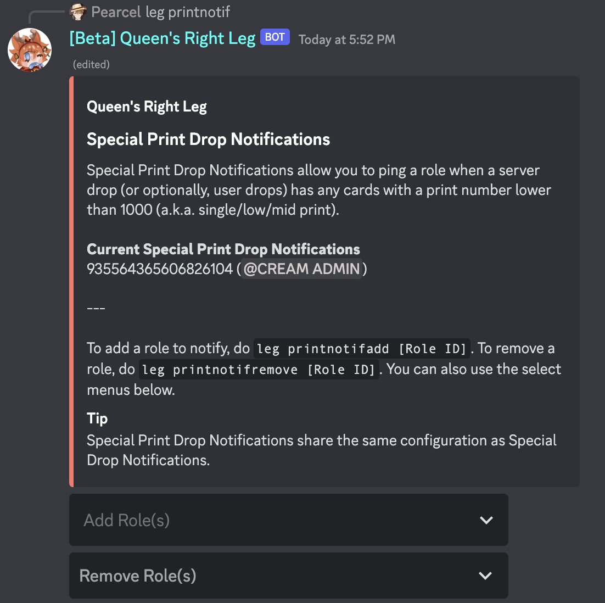

# bit\_cache

This controls whether Leg will remember what bits you have on you.

By disabling this, Leg will stop reading your bit information, as well as delete it (not immediately, however).

Features that rely on knowing what bits you have in your inventory will be completely inaccessible.
